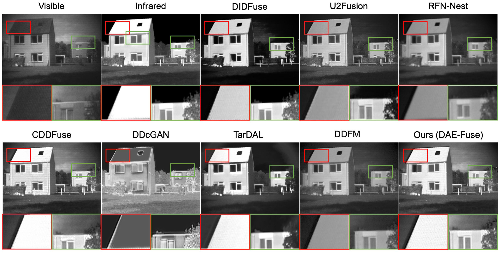
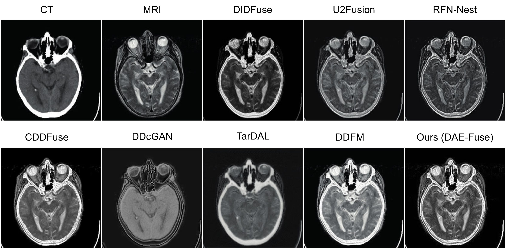

# DAE-Fuse: An Adaptive Discriminative Autoencoder for Multi-Modality Image Fusion

### 🎉🎉🎉 Accepted by ICME 2025 as Oral Presentation Paper 🎉🎉🎉

Please refer to the video fusion result at the Project Page.
<div style="display: flex; gap: 20px; margin-top: 20px;">

  <!-- Project Page -->
  <a href="https://eurekaarrow.github.io/daefuse.github.io/" target="_blank">
    
  </a>

  <!-- Paper -->
  <a href="https://www.arxiv.org/pdf/2409.10080" target="_blank">
    
  </a>

</div>


Abstract

In extreme scenarios such as nighttime or low-visibility environments, achieving reliable perception is critical for applications like autonomous driving, robotics, and surveillance. Multi-modality image fusion, particularly integrating infrared imaging, offers a robust solution by combining complementary information from different modalities to enhance scene understanding and decision-making. However, current methods face significant limitations: GAN-based approaches often produce blurry images that lack fine-grained details, while AE-based methods may introduce bias toward specific modalities, leading to unnatural fusion results. To address these challenges, we propose DAE-Fuse, a novel two-phase discriminative autoencoder framework that generates sharp and natural fused images. Furthermore, We pioneer the extension of image fusion techniques from static images to the video domain while preserving temporal consistency across frames, thus advancing the perceptual capabilities required for autonomous navigation. Extensive experiments on public datasets demonstrate that DAE-Fuse achieves state-of-the-art performance on multiple benchmarks, with superior generalizability to tasks like medical image fusion.





If you find DAE-Fuse useful for your work please cite:
```
@article{park2021nerfies
  author    = {Guo, Yuchen and Xu, Ruoxiang and Li, Rongcheng and Su, Weifeng},
  title     = {DAE-Fuse: An Adaptive Discriminative Autoencoder for Multi-Modality Image Fusion},
  journal   = {ICME},
  year      = {2025},
}
```

# Website License
<a rel="license" href="http://creativecommons.org/licenses/by-sa/4.0/"></a><br />This work is licensed under a <a rel="license" href="http://creativecommons.org/licenses/by-sa/4.0/">Creative Commons Attribution-ShareAlike 4.0 International License</a>.
